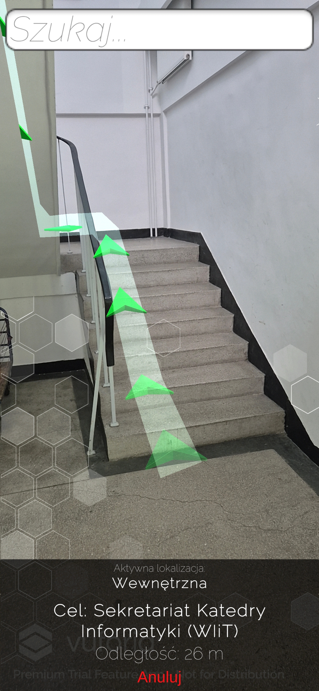
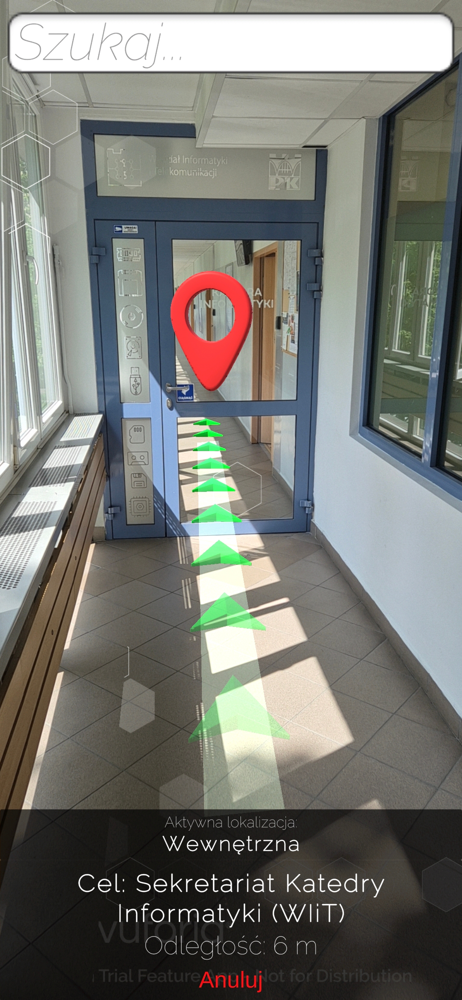
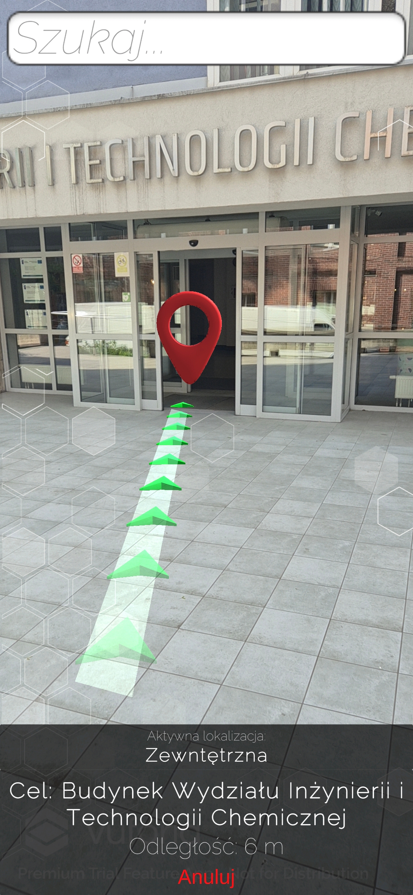
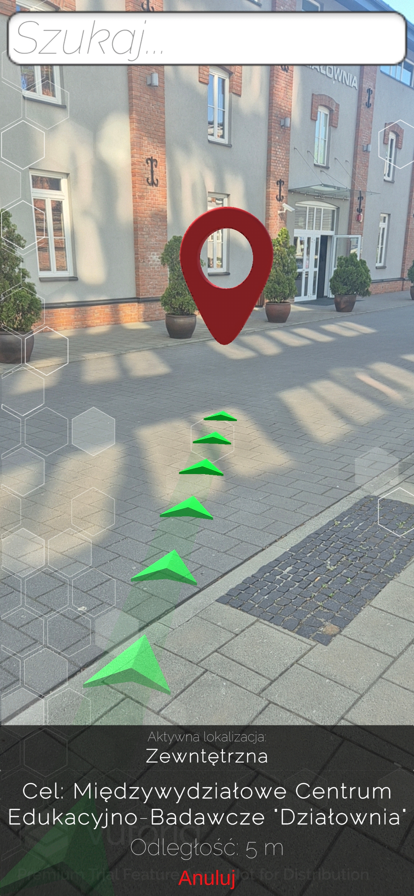
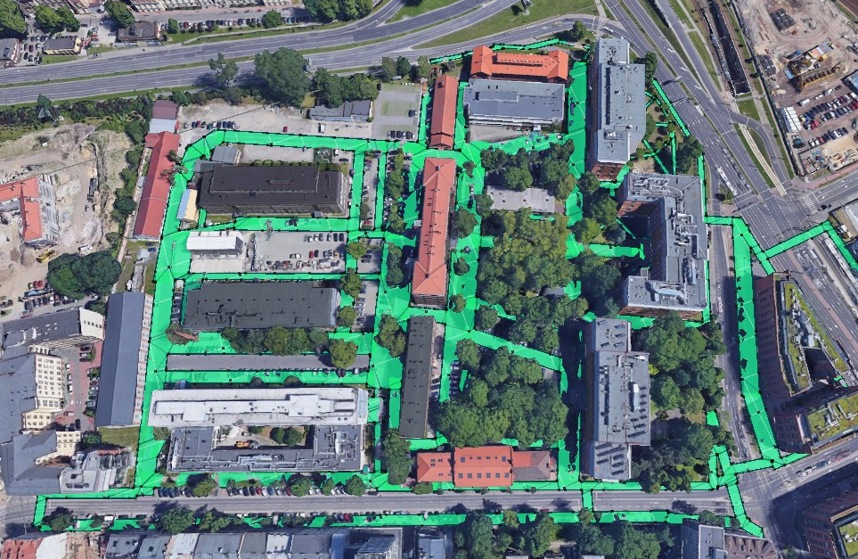
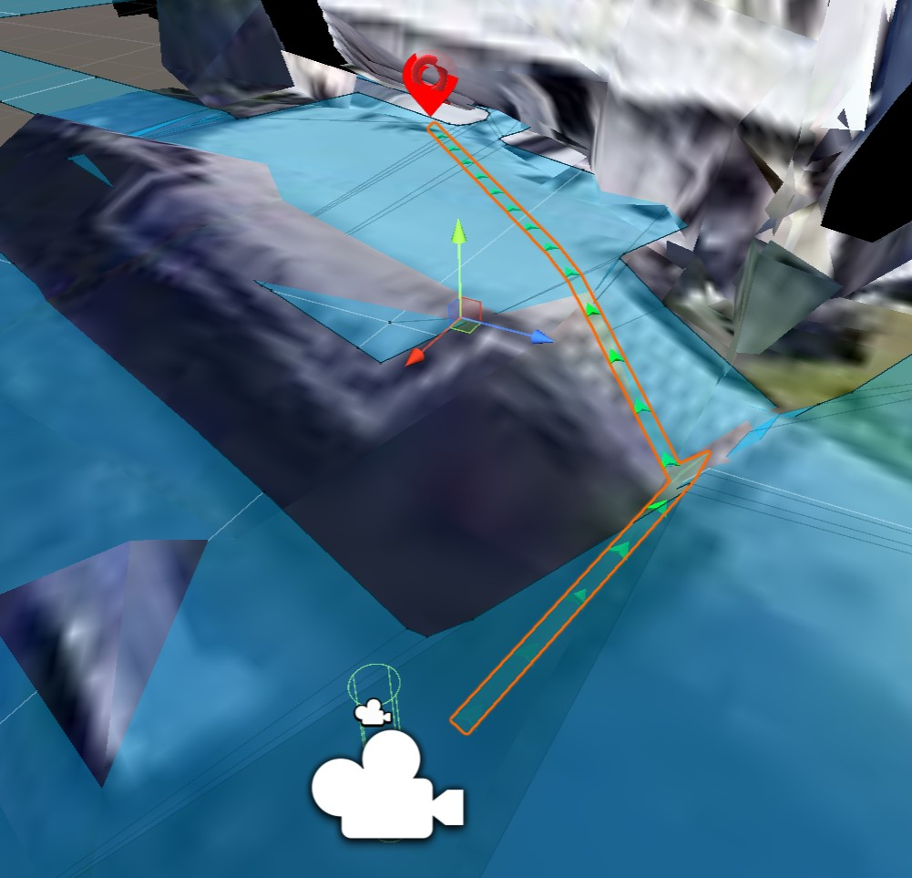
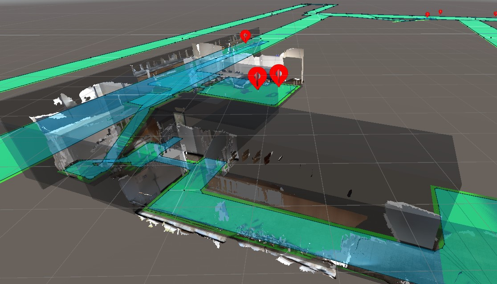

# 📱 Campus AR
Augmented Reality Navigation App for the Cracow University of Technology

## Overview
**Campus AR** is an Android application developed as part of my Master of Science thesis in Computer Science.  
The project explores how **augmented reality (AR)** can enhance navigation on large academic campuses by providing real-time visual guidance directly on top of the camera view of a mobile device.

The application was designed for the campus of the **Cracow University of Technology**, with a dual focus on **outdoor navigation** (using GPS and geospatial data) and **indoor navigation** (using AR-based spatial tracking). Users can select a target location such as lecture halls, libraries, or main entrances, and the app generates a dynamic route with **virtual arrows, paths, and markers** displayed in the real environment.  

This project demonstrates how **Unity** and modern AR frameworks can be combined to create scalable, reliable, and user-friendly navigation systems that bridge physical and digital spaces.

## Key Features
- Real-time navigation using AR overlays (arrows, paths, markers) visible through the camera.
- Automatic switching between **outdoor GPS-based navigation** and **indoor AR tracking**.
- Selection of points of interest including lecture halls, dean’s offices, labs, libraries, and entrances.
- Smooth performance and responsive interaction even under GPS loss or signal interference.
- Scalable design allowing easy addition of new buildings, rooms, and features.

## Technologies Used
- **Unity Engine (C#)** for core development and scripting.
- **AR Foundation** for cross-platform AR support.
- **Google ARCore (Geospatial API)** for outdoor positioning and orientation.
- **Vuforia Engine** for accurate indoor spatial mapping and tracking.
- **Cesium for Unity** for importing 3D terrain and realistic building models.
- **Unity AI Navigation** for dynamic pathfinding in 3D environments.
- **Universal Render Pipeline (URP)** for optimized rendering on mobile devices.

## Skills Demonstrated
- Development of a full AR application lifecycle in Unity.
- Advanced use of AR frameworks (ARCore, Vuforia, AR Foundation) and their integration.
- Implementation of indoor/outdoor hybrid navigation logic.
- Real-time pathfinding and AI navigation in 3D environments.
- UX/UI design tailored for mobile AR navigation systems.
- Experience with mobile development on Android and Unity project configuration.

## Screenshots
### Working app

  
  
  
  

### Unity project

  
  

